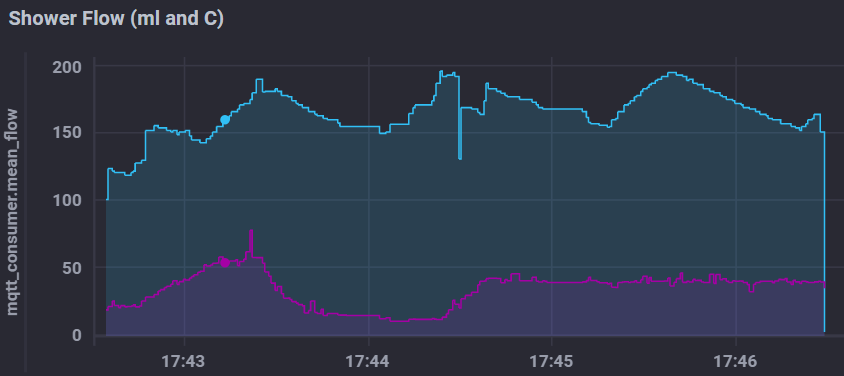

# FlowMeter
Flow meter for tracking shower usage (every second: flow, temperature, after 30s of no flow: total volume, duration).

WiFi -> MQTT -> Telegraf -> InfluxDB -> Chronograf:

First used a Wemos D1 mini, then a Doit ESP32.

All photos/videos: https://photos.app.goo.gl/8Zbm7jH6h51TRUgj6

See [log.md](log.md) for history/development notes.
